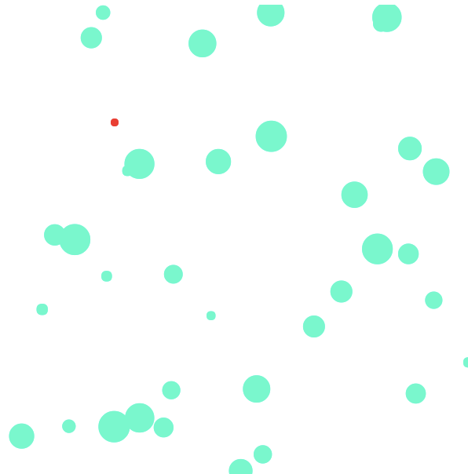

# js_games
Browser recreations of classic mini-games:
* Minesweeper (React.js)      [play](https://samblyon.github.io/js_games/react_minesweeper)
  * Clear the minefield without stepping on a mine!
  * Numbers on tiles indicate the number of bombs adjacent
  * Alt-click to flag a tile
* Asteroids (jQuery)          [play](https://samblyon.github.io/js_games/jquery_asteroids/lib)
  * You are the red dot.
  * Clear the field of asteroids without becoming space debris!
  * Arrow keys to boost, space to shoot
* Towers of Hanoi (jQuery)    [play](https://samblyon.github.io/js_games/jquery_towers_of_hanoi/html)
  * Move the pile of tiles to another "tower" while keeping tiles stacked smallest to largest!
  * Click a source tower to take a tile, and a destination tower to place it
  
### Screenshots

Asteroids

